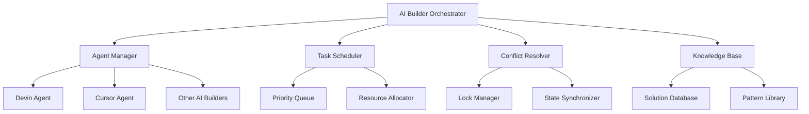

# 🤖 AI Builder Orchestrator

> **Central hub for coordinating autonomous AI development agents like Devin, Cursor, and other AI Builders**

[](https://github.com/MyMindVentures/AI-Builder-Orchestrator)
[](https://app.northflank.com)
[](https://modelcontextprotocol.io)

## 🎯 Overview

The **AI Builder Orchestrator** is the central nervous system of the Proof of Mind Ecosystem, coordinating multiple AI development agents to work together seamlessly. It prevents conflicts, manages workflows, and ensures optimal resource utilization across all AI-powered development processes.

## ✨ Key Features

### 🧠 **Intelligent Agent Coordination**

- **Multi-Agent Management**: Coordinates Devin, Cursor, and other AI builders
- **Conflict Resolution**: Prevents agents from working on the same tasks
- **Workflow Optimization**: Ensures efficient task distribution
- **Resource Management**: Manages computational resources across agents

### 🔄 **Cross-Project Communication**

- **MCP Integration**: Full Model Context Protocol support
- **Real-time Sync**: Live communication between all ecosystem projects
- **Event Broadcasting**: Notifies other services of important events
- **State Management**: Maintains consistent state across the ecosystem

### 📊 **Advanced Monitoring**

- **Agent Performance Tracking**: Monitors efficiency and success rates
- **Task Queue Management**: Intelligent task prioritization
- **Error Pattern Recognition**: Learns from failures to prevent repetition
- **Analytics Dashboard**: Real-time insights into AI agent activities

### 🛡️ **Error Prevention System**

- **Learning Database**: Stores solutions to common problems
- **Pattern Recognition**: Identifies recurring issues
- **Proactive Guidance**: Provides suggestions before problems occur
- **Knowledge Sharing**: Distributes learnings across all agents

## 🏗️ Architecture



## 🚀 Quick Start

### Prerequisites

- Node.js 18+
- Access to AI development agents
- NorthFlank deployment environment

### Installation

```bash
# Clone the repository
git clone https://github.com/MyMindVentures/AI-Builder-Orchestrator.git
cd AI-Builder-Orchestrator

# Install dependencies
npm install

# Start development server
npm run dev
```

### Production Deployment

```bash
# Deploy to NorthFlank (automatic CI/CD)
git push origin main
# NorthFlank will automatically build and deploy
```

## 📋 API Endpoints

### Agent Management

- `POST /api/agents/register` - Register new AI agent
- `GET /api/agents` - List all registered agents
- `PUT /api/agents/:id/status` - Update agent status
- `DELETE /api/agents/:id` - Unregister agent

### Task Management

- `POST /api/tasks` - Create new task
- `GET /api/tasks` - List all tasks
- `PUT /api/tasks/:id/assign` - Assign task to agent
- `PUT /api/tasks/:id/complete` - Mark task as complete

### Monitoring

- `GET /api/health` - Health check endpoint
- `GET /api/metrics` - Performance metrics
- `GET /api/analytics` - Usage analytics
- `GET /api/errors` - Error tracking

## 🔧 Configuration

### Environment Variables

```env
# Core Configuration
NODE_ENV=production
PORT=3001
LOG_LEVEL=info

# Database
DATABASE_URL=sqlite://./data/orchestrator.db

# AI Services
OPENAI_API_KEY=your_openai_key
ANTHROPIC_API_KEY=your_anthropic_key

# MCP Integration
MCP_SERVER_URL=http://localhost:3000
MCP_AUTH_TOKEN=your_mcp_token

# Monitoring
SENTRY_DSN=your_sentry_dsn
```

### MCP Server Configuration

The orchestrator integrates with multiple MCP servers:

- **Doppler MCP**: Secret management
- **NorthFlank MCP**: Deployment operations
- **GitHub MCP**: Version control
- **Memory MCP**: Persistent knowledge storage

## 📊 Monitoring & Analytics

### Real-time Metrics

- **Agent Utilization**: How efficiently agents are being used
- **Task Completion Rate**: Success rate of assigned tasks
- **Conflict Resolution**: Number of conflicts detected and resolved
- **Knowledge Base Growth**: New solutions added to the database

### Health Checks

- **Agent Connectivity**: All agents are reachable
- **Database Health**: SQLite database is operational
- **MCP Integration**: All MCP servers are responding
- **Resource Usage**: CPU and memory utilization

## 🛠️ Development

### Project Structure

```
src/
├── agents/           # Agent management logic
├── database/         # Database operations
├── orchestrator/     # Core orchestration logic
├── services/         # External service integrations
└── index.js         # Application entry point
```

### Adding New Agents

1. Create agent configuration in `src/agents/`
2. Implement agent interface
3. Register with orchestrator
4. Test integration
5. Deploy to production

### Testing

```bash
# Run unit tests
npm test

# Run integration tests
npm run test:integration

# Run with coverage
npm run test:coverage
```

## 🔒 Security

### Authentication

- **JWT Tokens**: Secure API authentication
- **Role-based Access**: Different permission levels
- **Rate Limiting**: Prevent abuse of API endpoints
- **Input Validation**: Sanitize all inputs

### Data Protection

- **Encrypted Storage**: All sensitive data encrypted
- **Secure Communication**: HTTPS for all communications
- **Audit Logging**: Track all operations
- **Backup Strategy**: Regular automated backups

## 📈 Performance

### Optimization Features

- **Connection Pooling**: Efficient database connections
- **Caching Layer**: Redis for frequently accessed data
- **Load Balancing**: Distribute load across instances
- **Auto-scaling**: Scale based on demand

### Benchmarks

- **Response Time**: < 100ms for API calls
- **Throughput**: 1000+ requests per second
- **Uptime**: 99.9% availability target
- **Memory Usage**: < 512MB per instance

## 🤝 Contributing

### Development Workflow

1. Fork the repository
2. Create feature branch
3. Make changes with tests
4. Submit pull request
5. Code review process
6. Merge to main branch

### Code Standards

- **ESLint**: Code quality enforcement
- **Prettier**: Code formatting
- **Jest**: Unit testing
- **TypeScript**: Type safety (where applicable)

## 📚 Documentation

### Additional Resources

- [API Documentation](./docs/api.md)
- [Agent Integration Guide](./docs/agents.md)
- [MCP Integration](./docs/mcp.md)
- [Deployment Guide](./docs/deployment.md)

### Support

- **GitHub Issues**: Bug reports and feature requests
- **Discussions**: Community discussions
- **Wiki**: Additional documentation
- **Email**: support@mymindventures.com

## 📄 License

This project is licensed under the MIT License - see the [LICENSE](LICENSE) file for details.

## 🙏 Acknowledgments

- **OpenAI**: For GPT-4 integration
- **Anthropic**: For Claude integration
- **MCP Community**: For Model Context Protocol
- **NorthFlank**: For deployment platform
- **Neurodiverse Community**: For inspiration and feedback

---

**Built with ❤️ for the AI development community**

_"Orchestrating the future of AI-powered development"_
